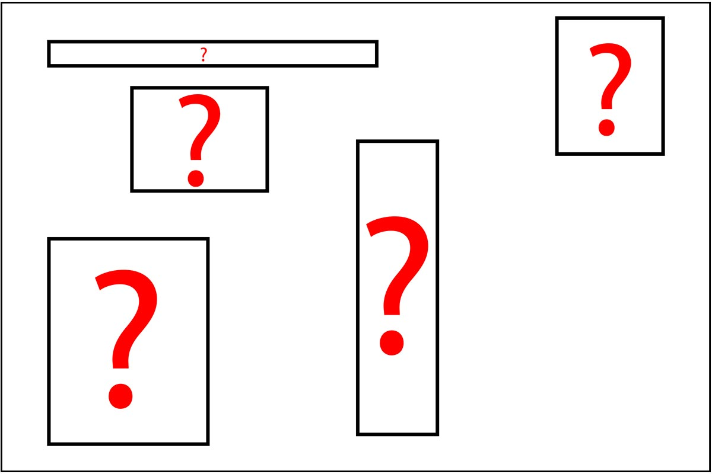
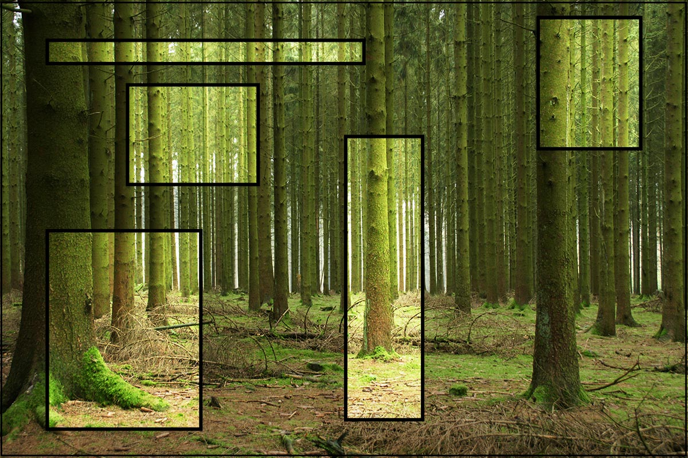
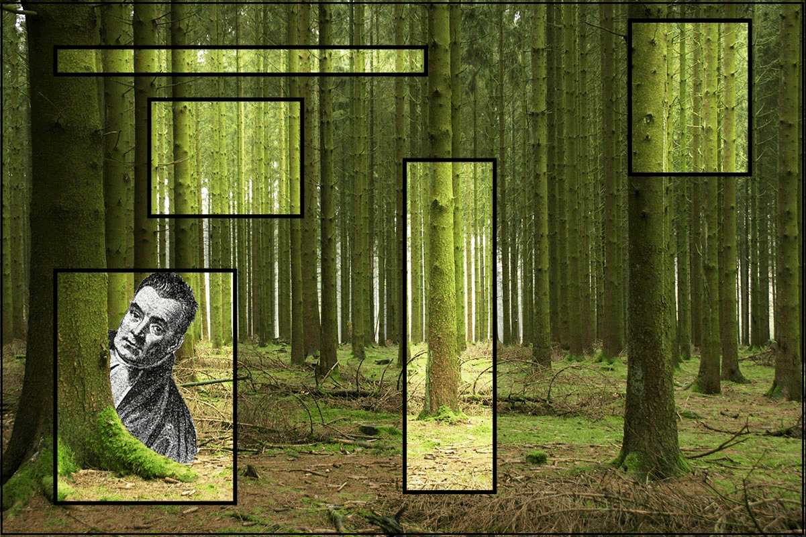

## Disclaimer

This presentation is made solely by myself and is pretty much completely based on the work of others. 

Images are bluntly borrowed from other sources; mostly without specific consent but with the conjugate prior that the authors would not care at all. 

The information in most slides comes from joint contemplation and/or work with Stef van Buuren, Jeroen Pannekoek, Shahab Jolani, Tom Bergkamp and Lisanne Rijnveld. 

The remaining knowledge comes from @rubin, @molenberghs2014handbook and @gelman2004bayesian.

I am fully aware that the image does probably not depict the reverent Bayes. Yet, it serves a purpose.

##Some oneliners to begin with

- Bayesian data analysis uses probability to make inferences based on data. 

- The core of Bayes is the quantification of uncertainty when making inferences. 

- Missing data leads to additional uncertainty.

- Not addressing the uncertainty properly leads to invalid inference.

- Invalid inference may get you tar-and-feathered. 

## Missing data & Bayes

- The problem
- The solvable problem
- Bayes in missing data
- Missing data in Bayes
- Assumptions
- Some advice
  

# The problem
## Let us assume a data set

## For sake of simplicity

We assume

- the data are sampled from a population
- through random sampling
- the variables are `random'
- the sample is smaller than the population
- the observed data are bonafide

Hence

- we have sampling variation
- the population quantities are somewhat known

## The data has missings

## This leads to problems

The data statistics are not defined

- means, variances, etc
- test statistics
- order statistics
    

    
The observed data statistics are defined

- but may be heavily biased 
  
    - the population statistics are suddenly unknown
    - how to verify the existence of bias in our sample?

## Missing data vs observed data 

Whether your incomplete sample is unbiased cannot simply be verified; therefor we need assumptions to work with the data. 

- **Assumption 1: The observed data holds the same information as the missing data**
- **Assumption 2: The observed data holds (unique) information about the missing data and missingness**
- **Assumption 3: The missing data holds vital information about itself and/or its missingness**

With 1 and 2, valid inference about the joint observed/missing data can be obtained by basing our models on the observed data alone. 

With 3 we would need information about the missing data to obtain valid inference.

## We miss a lot of information

## Don't focus on the part that is missing

## Make use of the part that you have

## To infer about the big picture

## And let the reverent guide you

# Bayes in contemporary missing data theory
## Solve the missingness first

Solve the missing data problem with Bayes through multiple imputation
    
1. fill in each missing datum $m$ times
    - by drawing from the posterior predictive distribution of $Y_{\text{mis}}$ conditional on $Y_{\text{obs}}$
    
2. Draw from the posterior distribution of the model parameters $\theta$
3. Combine the results to a single inference - e.g. cf. Rubin's rules (Rubin, 1987)
    - Usually by simply averaging over the distribution of the missing values

## In practice - 2 flavors
1. Joint modeling: the data $Y$ is described by the multivariate distribution $P(Y|\theta)$
    
    - usually assumed to be multivariate normally distributed
    - assumption-laden. when assumptions hold --> elegant!
    
2. Fully conditional specification: $P(Y|\theta)$ described through the set of conditional densities $P(Y_j|Y_{-j}, \phi_j)$
    - possibly incompatible Gibbs sampler (PIGS)
    - extremely flexible: allows for mixture of data and even allows for variables that are mixtures

$\theta$ are the unknown parameters of the multivariate distribution, $\phi$ are the unknown parameters of the imputation model.

## Benefits of multiple imputation
1. Blazingly fast convergence of the Gibbs sampler as only the incomplete data is updated
2. Computational advantages when compared to e.g. maximum likelihood
    - Especially for complex problems
3. Model the data and the missingness simultaneously
4. In two flavours: justified and probably justified
5. Widely implemented in software
6. Statistically valid

## Recap

# So, why does this work?
## Because fully Bayesian

## The parts needed / available
1. The observed data $Y$ are known
2. The statistical parameters of interest $\theta$ are not

Hence, the inference centers around the posterior distribution 
\[p(\theta | Y) \propto p(\theta)p(Y|\theta).\]

An appropriate joint model needs to be specified for 

- the observed data
- the missing data
- the unknown parameters.

# A major caveat: ignorability
## Ignorability and Bayes  
Missingness is said to be ignorable in Bayesian inference under the following three conditions:

1. MAR missingness
2. Parameter $\theta$ is distinct from the parameter of missing data process.
3. A-priori independence between $\theta$ and the missingness parameter.

Under Bayesian ignorability,  inference on the full data response model parameters only requires 

- A specified full data response model
- A prior on the full data response model parameters. 

## Nonignorability and Bayes
If ignorability does not hold:

- We need something that characterizes the assumptions about the conditional distribution of the missing data given the observed information. 

Therefore:

1. the **full data model** needs to be specified
2. the extrapolation distribution needs to be specified (may be implicit):
    - Assumptions about the missingness (not verifyable)
    - Assumptions about the modeling of it all
    - an informative prior for the extrapolation distribution $\theta_E$.

## But...

The prior may be formally identical to the posterior distribution of the parameter of the distribution of the incomplete variable (given the observed data). See e.g. @rubin [chapter 6].

Again, this is not verifyable. 

Hence, it is then sensible to use a mixture approach. 

- Introduces a sensitivity parameter that can be monitored.
- if no change --> not sensitive --> ignorable
- if change --> bad luck

# Assumptions recap

## Two core assumptions:
1. the observed data are bonafide
2. the incomplete data (analysis model) AND the missingness mechanism can be modelled

    - either by basing a model on the observed data
    - or formulating a (non-informative) prior 

**NEVER forget that you deal with an imputation model and an inference model.**

  - Take covariates that relate to the missingness into account
  - Read [@meng1994] on congeniality

IN ALL CASES: whenever you suspect that an assumption is violated --> Do sensitivity analysis

# Frequently Asked Questions

## Let's get theoretical: the first 3
1. There is only a tiny portion of missingness; this can never have a too large effect. It is then okay to ignore the missing values, right?
    - Sigh. No. Besides: Ignorable missingness does NOT imply that you may ignore the missing values. 
2. There is too much missingness; this must have an effect!
    - The more you miss, the more important your assumptions become. 
    - The theoretical framework stays equally valid for all percentages missingness. 
3. Up until what percentage of missingness may I impute?
    - See (2). Also; the amount of missing information about the estimand is important. 

## Let's get theoretical: the last one
4. I am a social scientist and my data is MCAR. I can ignore the missingness!
    - Sure. Would you like a glass of unicorn milk to go with your fairytale?
    - In real life; data are almost never MAR. Let alone MCAR. 
    - No way to distinguish between MAR and MNAR. 

## Let's get practical: the top 3
1. Impute scale items or scale totals?
    - Items. When many items --> use FCS and only take the largest predictor relations into account (e.g. the 5 or 10 best predictors per incomplete variables)
2. Combine groups before or after imputation?
    - After. Always stay as close as possible to the true data model during imputation
3. If a variable is completely missing for a group of cases
    - Central assumption: the other groups hold information that applies to the multivariate distribution of this group
    - Impute only if no suspicion of assumption breach

## Always report

1. Amount of missing data
2. Reasons for missingness
3. Differences between complete and incomplete data
4. Method used to account for missing data
5. Software and version
6. Number of imputed datasets
7. Imputation model
8. Derived variables
9. Diagnostics (& sensitivity if relevant)
10. Pooling (for imputation)
11. Listwise deletion results

## References
