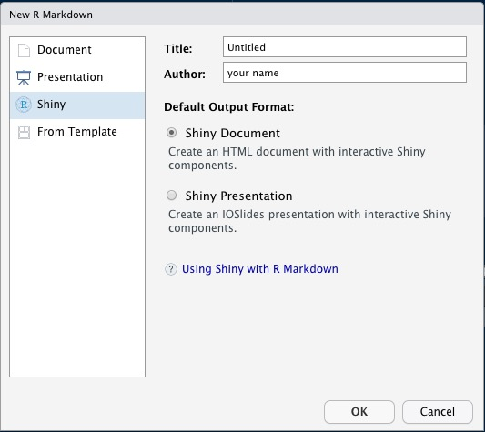

```{r setup, include=FALSE}
knitr::opts_chunk$set(echo = FALSE, message = FALSE)
library(shiny)
library(ggplot2)
library(dplyr)
library(psych)
library(palmerpenguins)

scale_color_palmer <- function(){scale_color_manual(values = c("Adelie" = "darkorange", "Chinstrap" = "darkorchid", "Gentoo" = "cyan4"))}
```

## What we'll discuss

1. The `shiny` framework
2. The user interface (UI)
3. The server
4. Advanced topics
5. Take-aways

# The `shiny` framework {.build}

## The basics

What is `shiny`?
 
- An `R` package for building `shiny` apps.

<br> 

What is a `shiny` app?

- A fully interactive (web) application, which can be:
    - build as a dashboard;
    - hosted online on a webpage;
    - included in `R` Markdown documents.

## The aim 
<!-- {.build} -->

Why use `shiny`?

- To create apps!

- Make your `R` workflows:
    - interactive (point-and-click style);
    - reproducible for non-coders;
    - look instantly professional.

## The package 

What does `shiny` offer?

- A collection of wrapper functions to write "app languages":
    - geared toward `R` users who have zero experience with web development;
    - no knowledge of  `HTML`/`CSS`/`JavaScript` required;
    - but you *can* extend it with `CSS` themes, `HTML` widgets, and `JavaScript` actions. 
- Developed by RStudio, so documentation and support are more or less guaranteed.


## The template app

<div style="float: left; width: 50%;">
How to build a `shiny` app?

A. Create a file called `app.R` and add `shiny` components* 

<div class = "green"> __B. In RStudio: File &rarr; New file &rarr; R Markdown &rarr; Shiny__ </div>

<div class="small"> <br><br><br> *file name and components are non-negotiable!</div>
</div>

<div style="float: right; width: 50%;">
<div align="center">

</div>
</div>

## The template app

```{r eruptions}
inputPanel(
  selectInput("n_breaks", label = "Number of bins:",
              choices = c(10, 20, 35, 50), selected = 20),
  
  sliderInput("bw_adjust", label = "Bandwidth adjustment:",
              min = 0.2, max = 2, value = 1, step = 0.2)
)

renderPlot({
  hist(faithful$eruptions, probability = TRUE, breaks = as.numeric(input$n_breaks),
       xlab = "Duration (minutes)", main = "Geyser eruption duration")
  
  dens <- density(faithful$eruptions, adjust = input$bw_adjust)
  lines(dens, col = "blue")
})
```

## The components {.build}

What does a `shiny` app consist of?

- A user interface (UI):
    - the visible, interactive part;
    - e.g., a web app or dashboard.
- A server:
    - the invisible, processing part;
    - e.g., your own computer or [shinyapps.io](shinyapps.io).

```{r, echo=TRUE, eval=FALSE}
library(shiny)
ui <- # some code to generate the UI
server <- # some code to generate the server
shinyApp(ui = ui, server = server)
```


## Starting point

<!-- We're going to create a `shiny` app to visualize some data interactively. -->

```{r, echo=TRUE}
library(shiny)
ui <- fluidPage()
server <- function(input, output) {}
shinyApp(ui = ui, server = server)
```


## Our app


## Case study

The [palmer penguins](https://allisonhorst.github.io/palmerpenguins/) `penguins` dataset. 

```{r}
head(penguins)
```

<!-- <div class="small">Note. to make sure `R` can find the data for your app (e.g., load it on the server side, or let the user upload a dataset)!</div> -->

## Case study

<div style="float: left">
<div align="left">

</div>
</div>

<div style="float: right">
<div align="right">

</div>
</div>


## Tips

Don't rush into coding when you should be thinking.

Before building a `shiny` app, think about:

- What is the app aimed at?
- Who are the end users of your app? Are they tech-literate?
- In what context will the app be used? On what machines (e.g., because of screen size)? 


## Tips

While building a `shiny` app: 

- Keep It Simple, Stupid;
- Use a design/UI first approach;
- Build the front-end and the back-end separately;
- If you copy something just *once*, make it a function;
- Avoid unnecessary complexity and 'feature creep'.

## Tips

After building a `shiny` app:

- Share the app;
- Make it last.

<br><br>
<div class="small">Note. We'll get back to this later!</div>

# The UI

## Adding a title

```{r, echo=TRUE, results='hide'}
ui <- fluidPage(
  titlePanel("Palmer penguins")
)
```

The `shiny` function `titlePanel()` 

- adds a visible big title-like text to the top of the page;
- sets the “official” title of the web page (i.e., displayed at the name of the tab in the browser).

## Our app

```{r, echo=FALSE}
library(shiny)

ui <- fluidPage(
  titlePanel("Palmer penguins")
  )

server <- function(input, output) {}

shinyApp(ui = ui, server = server)
```

## Adding some text

To render text in our app, we can just add character/string objects inside `fluidPage()`:

```{r, echo=TRUE}
ui <- fluidPage(
  titlePanel("Palmer penguins"),
  "An interactive", 
  "visualization"
  )
```

## Our app

```{r, echo=FALSE}
library(shiny)


ui <- fluidPage(
  titlePanel("Palmer penguins"),
  "An interactive", 
  "visualization"
  )

server <- function(input, output) {}

shinyApp(ui = ui, server = server)
```

## Adding formatted text

For formatted text, `shiny` has many functions that are wrappers around HTML tags. For example:

- `h1()`: top-level header; 
- `h2()`: secondary header; 
- `strong()`: bold text; 
- `em()`: italicized text; 
- `br()`: line break;
- `img()`: image;
- `a()`: hyperlink, etc.

<div class="small">Note. If you already know HTML, you don't need to use these wrapper functions!</div>

## Adding formatted text

Let's replace the UI part of our code with the following:

```{r, echo=TRUE, results='hide'}
ui <- fluidPage(
  titlePanel("Palmer penguins"),
  "An",
  em("interactive"),
  br(),
  strong("visulalization")
)
```

## Our app

```{r, echo=FALSE}
library(shiny)


ui <- fluidPage(
  titlePanel("Palmer penguins"),
  "An",
  em("interactive"),
  br(),
  strong("visulalization")
)

server <- function(input, output) {}

shinyApp(ui = ui, server = server)
```

## Adding a layout {.build}

The simple sidebar layout: 

- provides a two-column layout with a smaller sidebar and a larger main panel; 
- visually separates the input and output of the app.

We'll replace the formatted text by a sidebar layout:

```{r, echo=TRUE, results='hide'}
ui <- fluidPage(
  titlePanel("Palmer penguins"),
  sidebarLayout(
    sidebarPanel("[inputs]"),
    mainPanel("[outputs]")
  )
)
```


## Our app

```{r, echo=FALSE}


ui <- fluidPage(
  titlePanel("Palmer penguins"),
  sidebarLayout(
    sidebarPanel("[inputs]"),
    mainPanel("[outputs]")
  )
)

server <- function(input, output) {}

shinyApp(ui = ui, server = server)
```

## Adding an input element 

Inputs allow users to interact with a `shiny` app. 

We've seen two types already:

- `selectInput()` creates a dropdown menu (e.g., number of bins in the template app);
- `sliderInput()` creates a numeric scale (e.g., bandwidth adjustment in the template app).

```{r, echo=FALSE}
inputPanel(
  selectInput("n_breaks", label = "Number of bins:",
              choices = c(10, 20, 35, 50), selected = 20),
  
  sliderInput("bw_adjust", label = "Bandwidth adjustment:",
              min = 0.2, max = 2, value = 1, step = 0.2)
)
```

## Adding an input element 

Can you guess what kind of element these input functions will create?

- `textInput()`; 
- `dateInput()`; 
- `checkboxInput()`.

## Adding input elements

<div align="center">
<br>

</div>

## Adding an input element {.build}

Which function would suit an input element for the variable `island`?

```{r, echo=FALSE}
inputPanel(
radioButtons(
  inputId = "location", 
  label = "Location",
  choices = c("Biscoe", "Dream", "Torgersen")
  ), br()
)
```

<br> 

```{r, echo=TRUE, results='hide'}
radioButtons(
  inputId = "location", 
  label = "Location",
  choices = c("Biscoe", "Dream", "Torgersen")
  )
```


## Adding an input element {.build}

All input functions have the same first two arguments:

- `inputId`, the name by which `shiny` will refer to this input when you want to retrieve its current value;
- `label`, which specifies the text displayed right above the input element.

These argument names are typically dropped from the `...Input()` function call: 

```{r, echo=TRUE, results='hide'}
radioButtons("location", "Location", choices = c("Biscoe", "Dream", "Torgersen"))
```

<div class="small">Note. Every input in your app *must* have a unique `inputId`; the app will not work properly otherwise! So keep your `inputId`s simple and sensible.</div>

## Adding an input element 

The resulting UI code looks like:

```{r, echo=TRUE, results='hide'}
ui <- fluidPage(
  titlePanel("Palmer penguins"),
  sidebarLayout(
    sidebarPanel(
      radioButtons("location", "Location", 
                   choices = c("Biscoe", "Dream", "Torgersen"))
      ),
    mainPanel("[outputs]")
  )
)
```

## Our app

```{r, echo=FALSE}
ui <- fluidPage(
  titlePanel("Palmer penguins"),
  sidebarLayout(
    sidebarPanel(
      radioButtons("location", "Location", choices = c("Biscoe", "Dream", "Torgersen"))
    ),
    mainPanel("[outputs]")
  )
)

server <- function(input, output) {}

shinyApp(ui = ui, server = server)
```

## Adding another input element {.build}

Let's create an input element for the variable `body_mass_g` as well. Which input function(s) should we use? 

```{r, echo=FALSE}
inputPanel(
sliderInput("weight", "Weight", 
  min = 2, max = 7, value = c(3, 5), post = "kg"
  )
)
```

<br> 

```{r, echo=TRUE, results='hide'}
sliderInput("weight", "Weight", 
            min = 2, max = 7, value = c(3, 5), post = "kg")
```

## Adding another input element

The full UI code is now: 

```{r, echo=TRUE, results='hide'}
ui <- fluidPage(
  titlePanel("Palmer penguins"),
  sidebarLayout(
    sidebarPanel(
      radioButtons("location", "Location", 
                   choices = c("Biscoe", "Dream", "Torgersen")),
      sliderInput("weight", "Weight", 
                  min = 2, max = 7, value = c(3, 5), post = "kg")
    ),
    mainPanel("[outputs]")
  )
)
```

## Our app

```{r, echo=FALSE}
ui <- fluidPage(
  titlePanel("Palmer penguins"),
  sidebarLayout(
    sidebarPanel(
      radioButtons("location", "Location", choices = c("Biscoe", "Dream", "Torgersen")),
      sliderInput("weight", "Weight", min = 2, max = 7, value = c(3, 5), post = "kg")
    ),
    mainPanel("[outputs]")
  )
)

server <- function(input, output) {}

shinyApp(ui = ui, server = server)
```

## Adding an output element {.build}

Outputs are *shown* in the UI, but *created* on the server side. 

That's why we add placeholders for the outputs in the UI. 

Placeholders:  

- Determine where an output will be; 
- Give outputs a unique ID to link it to the server; 
- Won’t actually show anything, yet.

Let's add a figure as output in our app: 

```{r, echo=TRUE, results='hide'}
mainPanel(
  plotOutput("scatterplot")
)
```

## Our app

```{r, echo=FALSE}
ui <- fluidPage(
  titlePanel("Palmer penguins"),
  sidebarLayout(
    sidebarPanel(
      radioButtons("location", "Location", choices = c("Biscoe", "Dream", "Torgersen")),
      sliderInput("weight", "Weight", min = 2, max = 7, value = c(3, 5), post = "kg")
    ),
    mainPanel(
      plotOutput("scatterplot")
      )
  )
)

server <- function(input, output) {}

shinyApp(ui = ui, server = server)
```

## Adding another output element

The placeholder doesn't show anything, because we haven't created any figure yet on the server side.

But first, let's add another output element:

```{r, echo=TRUE, results='hide'}
mainPanel(
  plotOutput("scatterplot"),
  br(),
  br(),
  tableOutput("descriptives")
)

```

<div class="small">Note. We added a few line breaks `br()` between the two outputs, so that they aren't crammed on top of each other.</div>

## The complete UI

```{r, echo=TRUE, results='hide'}
ui <- fluidPage(
  titlePanel("Palmer penguins"),
  sidebarLayout(
    sidebarPanel(
      radioButtons("location", "Location", 
                   choices = c("Biscoe", "Dream", "Torgersen")),
      sliderInput("weight", "Weight", 
                  min = 2, max = 7, value = c(3, 5), post = "kg")
    ),
    mainPanel(
      plotOutput("scatterplot"),
      br(), 
      br(),
      tableOutput("descriptives")
    )
  )
)
```

## Our app

```{r, echo=FALSE}
ui <- fluidPage(
  titlePanel("Palmer penguins"),
  sidebarLayout(
    sidebarPanel(
      radioButtons("location", "Location", choices = c("Biscoe", "Dream", "Torgersen")),
      sliderInput("weight", "Weight", min = 2, max = 7, value = c(3, 5), post = "kg")
    ),
    mainPanel(
      plotOutput("scatterplot")
      )
  )
)

server <- function(input, output) {}

shinyApp(ui = ui, server = server)
```

## Tips

When building the front-end of your app:

- Work on the general appearance first, anything that does not rely on computation (e.g., tabs, inputs, outputs);
- Use mock data and/or text (build an 'ipsum-app');
- Make the app self-evident; the main usage of the app should not require reading any manual.


# The server

## The server function {.build}

```{r, echo=TRUE, results='hide'}
library(shiny)
ui <- fluidPage()
server <- function(input, output) {}
shinyApp(ui = ui, server = server)
```

The server function:

- requires* input and output IDs from the UI;
- builds output objects via `render...()` functions;
- saves the generated output into an output list.

<div class="small">*exceptions apply!</div>

## Building static output {.build}

Let's use the exception to the rule to develop our server step-by-step.

```{r eval = FALSE, echo=TRUE}
ggplot(penguins, 
  aes(x = flipper_length_mm, y = bill_length_mm, color = species)) +
  geom_point() +
  geom_smooth(method = "lm", se = FALSE) + 
  scale_color_palmer() +
  labs(title = "Flipper and bill length by species (static)")
```

## Building static output 

```{r echo=FALSE, message=FALSE, warning=FALSE}
ggplot(penguins, 
  aes(x = flipper_length_mm, y = bill_length_mm, color = species)) +
  geom_point() +
  geom_smooth(method = "lm", se = FALSE) + 
  scale_color_palmer() +
  labs(title = "Flipper and bill length by species (static)")
```

## Building static output

```{r eval = FALSE, echo=TRUE}
server <- function(input, output) {
  output$scatterplot <- renderPlot({
    ggplot(penguins, 
      aes(x = flipper_length_mm, y = bill_length_mm, color = species)) +
      geom_point() +
      geom_smooth(method = "lm", se = FALSE) + 
      scale_color_palmer() +
      labs(title = "Flipper and bill length by species (static)")
  })
}
```

## Our app

```{r, echo=FALSE, warning=FALSE, message=FALSE}
ui <- fluidPage(
  titlePanel("Palmer penguins"),
  sidebarLayout(
    sidebarPanel(
      radioButtons("location", "Location", choices = c("Biscoe", "Dream", "Torgersen")),
      sliderInput("weight", "Weight", min = 2, max = 7, value = c(3, 5), post = "kg")
    ),
    mainPanel(
      plotOutput("scatterplot"),
      br(), br(),
      tableOutput("descriptives")
    )
  )
)

server <- function(input, output) {
  output$scatterplot <- renderPlot({
    ggplot(penguins, 
      aes(x = flipper_length_mm, y = bill_length_mm, color = species)) +
      geom_point() +
      geom_smooth(method = "lm", se = FALSE) + 
      scale_color_palmer() +
      labs(title = "Flipper and bill length by species (static)")
  })
}

shinyApp(ui = ui, server = server)
```

## Building interactive output {.build}

To make the figure interactive, we have to link the server to the UI inputs. 

```{r eval = FALSE, echo=TRUE}
server <- function(input, output) {
  output$scatterplot <- renderPlot({
    ggplot(penguins, 
      aes(x = flipper_length_mm, y = bill_length_mm, color = species)) +
      geom_point() +
      geom_smooth(method = "lm", se = FALSE) + 
      scale_color_palmer() +
      labs(title = paste("Flipper and bill length at", input$location))
  })
}
```

Whenever the selected location changes, the plot title will update. 

## Our app

```{r, echo=FALSE, warning=FALSE, message=FALSE}
ui <- fluidPage(
  titlePanel("Palmer penguins"),
  sidebarLayout(
    sidebarPanel(
      radioButtons("location", "Location", choices = c("Biscoe", "Dream", "Torgersen")),
      sliderInput("weight", "Weight", min = 2, max = 7, value = c(3, 5), post = "kg")
    ),
    mainPanel(
      plotOutput("scatterplot"),
      br(), br(),
      tableOutput("descriptives")
    )
  )
)

server <- function(input, output) {
  output$scatterplot <- renderPlot({
    ggplot(penguins, 
      aes(x = flipper_length_mm, y = bill_length_mm, color = species)) +
      geom_point() +
      geom_smooth(method = "lm", se = FALSE) + 
      scale_color_palmer() +
      labs(title = paste("Flipper and bill length at", input$location))
  })
}

shinyApp(ui = ui, server = server)
```

## Building an interactive visualization {.build}

To incorporate interactivity in the visualization, we have to filter the data based on the input values.

```{r fig.keep='none', results='hide', echo=TRUE}
server <- function(input, output) {
  output$scatterplot <- renderPlot({
    filtered <- penguins %>%
      filter(island == input$location,
           body_mass_g >= input$weight[1] * 1000,
           body_mass_g <= input$weight[2] * 1000
      )  
    filtered %>% 
      ggplot(aes(x = flipper_length_mm, y = bill_length_mm, color = species)) +
        geom_point() +
        geom_smooth(method = "lm", se = FALSE) + 
        scale_color_palmer() +
        labs(title = "Flipper and bill length")
  })
}

```

## Our app

```{r, echo=FALSE, warning=FALSE, message=FALSE}
ui <- fluidPage(
  titlePanel("Palmer penguins"),
  sidebarLayout(
    sidebarPanel(
      radioButtons("location", "Location", choices = c("Biscoe", "Dream", "Torgersen")),
      sliderInput("weight", "Weight", min = 2, max = 7, value = c(3, 5), post = "kg")
    ),
    mainPanel(
      plotOutput("scatterplot"),
      br(), br(),
      tableOutput("descriptives")
    )
  )
)

server <- function(input, output) {
  output$scatterplot <- renderPlot({
    filtered <- penguins %>%
      filter(island == input$location,
           body_mass_g >= input$weight[1] * 1000,
           body_mass_g <= input$weight[2] * 1000
      )  
    filtered %>% 
      ggplot(aes(x = flipper_length_mm, y = bill_length_mm, color = species)) +
        geom_point() +
        geom_smooth(method = "lm", se = FALSE) + 
        scale_color_palmer() +
        labs(title = "Flipper and bill length")
  })
}

shinyApp(ui = ui, server = server)
```

## Building an interactive summary table

To complete our app we need to build an interactive output for the table placeholder and add it to the server: 

```{r, echo=TRUE, results='hide', message=FALSE, warning=FALSE}
output$descriptives <- renderTable({
  filtered <- penguins %>%
      filter(island == input$location,
           body_mass_g >= input$weight[1] * 1000,
           body_mass_g <= input$weight[2] * 1000
      )
  filtered %>% 
    group_by(species) %>% 
    summarise(across(c(bill_length_mm, flipper_length_mm), mean, na.rm = TRUE))
})
```

## Our app

```{r, echo=FALSE, warning=FALSE, message=FALSE}


ui <- fluidPage(
  titlePanel("Palmer penguins"),
  sidebarLayout(
    sidebarPanel(
      radioButtons("location", "Location", choices = c("Biscoe", "Dream", "Torgersen")),
      sliderInput("weight", "Weight", min = 2, max = 7, value = c(3, 5), post = "kg")
    ),
    mainPanel(
      plotOutput("scatterplot"),
      br(), br(),
      tableOutput("descriptives")
    )
  )
)

server <- function(input, output) {
  output$scatterplot <- renderPlot({
    filtered <- penguins %>%
      filter(island == input$location,
           body_mass_g >= input$weight[1] * 1000,
           body_mass_g <= input$weight[2] * 1000
      )  
    filtered %>% 
      ggplot(aes(x = flipper_length_mm, y = bill_length_mm, color = species)) +
        geom_point() +
        geom_smooth(method = "lm", se = FALSE) + 
        scale_color_palmer() +
        labs(title = "Flipper and bill length")
  })
  
  output$descriptives <- renderTable({
    filtered <- penguins %>%
      filter(island == input$location,
           body_mass_g >= input$weight[1] * 1000,
           body_mass_g <= input$weight[2] * 1000
      )
    filtered %>% 
      group_by(species) %>%
      summarise(across(c(bill_length_mm, flipper_length_mm), mean, na.rm = TRUE))
  })
}

shinyApp(ui = ui, server = server)
```

# Intermezzo

## Reactivity {.build}

Short break from our app to talk about a crucial concept in `shiny`: reactivity. 

Reactivity enables your outputs to react to changes in inputs. 

On the most basic level, it means that when the value of a variable `x` changes,  anything that relies on `x` (i.e. has `x` in it) gets re-evaluated. 

Consider the following code

```{r, echo=TRUE, results='hide'}
x <- 5
y <- x + 1
x <- 10
```

What is the value of `y`?

## Reactivity {.build}

What is the value of `y`?

```{r, echo=TRUE, results='hide'}
x <- 5
y <- x + 1
x <- 10
```

In ordinary programming, the value of `y` is still 6. 

In reactive programming, however, `x` and `y` are *reactive expressions*. Now, the value of `y` updates reactively, and becomes 11. 

Reactivity is the foundation for the responsiveness of `shiny` apps. 

## Reactivity

In our server, we implicitly use reactivity when we filter the data for our outputs: 

```{r eval=FALSE, include=TRUE, echo=TRUE, results='hide'}
filtered <- penguins %>%
    filter(island == input$location,
         body_mass_g >= input$weight[1] * 1000,
         body_mass_g <= input$weight[2] * 1000
    )
  )
```

Whenever one of the inputs changes, our outputs change with it. But, this part of code is duplicated, because we didn't use a reactive variable.  

## Reactivity {.build}

We can avoid code duplication by:

- defining a reactive variable that will hold the filtered dataset; 
- using that variable in the `render...()` functions.

```{r, echo=TRUE, results='hide'}
filtered <- reactive({
 penguins %>%
    filter(island == input$location,
           body_mass_g >= input$weight[1] * 1000,
           body_mass_g <= input$weight[2] * 1000
      )
})
```


## Reactivity {.build}

What is going on behind the scenes?

- The location input changes &rarr;
- `shiny` 'looks' at the reactive(s) that depend on location &rarr;
- `filtered()` is re-evaluated &rarr;
- `shiny` 'looks' at the reactive(s) that depend on `filtered()` &rarr;
- The two `render...()` functions are re-executed &rarr;
- The plot and the table output are updated.

This can be visualized in a dependency tree, to show what value depends on what other value.

## Reactivity

<div align="center">

</div>

# The server (continued)

## The final app {.smaller}

```{r, echo=TRUE, results='hide', message=FALSE, warning=FALSE}
server <- function(input, output) {
  filtered <- reactive({
    penguins %>%
      filter(island == input$location,
             body_mass_g >= input$weight[1] * 1000,
             body_mass_g <= input$weight[2] * 1000
             )
  })
  
  output$scatterplot <- renderPlot({
    filtered() %>% 
      ggplot(aes(x = flipper_length_mm, y = bill_length_mm, color = species)) +
        geom_point() +
        geom_smooth(method = "lm", se = FALSE) + 
        scale_color_palmer() +
        labs(title = "Flipper and bill length")
  })
  
  output$descriptives <- renderTable({
    filtered() %>% 
      group_by(species) %>%
      summarise(across(c(bill_length_mm, flipper_length_mm), mean, na.rm = TRUE))
  })
}
```

## Our app 

```{r, echo=FALSE, warning=FALSE, message=FALSE}
ui <- fluidPage(
  titlePanel("Palmer penguins"),
  sidebarLayout(
    sidebarPanel(
      radioButtons("location", "Location", choices = c("Biscoe", "Dream", "Torgersen")),
      sliderInput("weight", "Weight", min = 2, max = 7, value = c(3, 5), post = "kg")
    ),
    mainPanel(
      plotOutput("scatterplot"),
      br(), br(),
      tableOutput("descriptives")
    )
  )
)

server <- function(input, output) {
  filtered <- reactive({
   penguins %>%
      filter(island == input$location,
             body_mass_g >= input$weight[1] * 1000,
             body_mass_g <= input$weight[2] * 1000
        )
  })
  
  output$scatterplot <- renderPlot({
    filtered() %>% 
      ggplot(aes(x = flipper_length_mm, y = bill_length_mm, color = species)) +
        geom_point() +
        geom_smooth(method = "lm", se = FALSE) + 
        scale_color_palmer() +
        labs(title = "Flipper and bill length")
  })

  output$descriptives <- renderTable({
    filtered() %>%
      group_by(species) %>%
      summarise(across(c(bill_length_mm, flipper_length_mm), mean, na.rm = TRUE))
  })
}

shinyApp(ui = ui, server = server)
```

## Tips 

When building the back-end of your app:

- Use sensible non-reactive defaults while developing (e.g., `data <- mtcars` instead of `data <- reactive(...).`);
- Think about what could to be 'hard coded' in the final app too, because of the reactivity vs. speed trade-off;
- Extract the complex (but non-reactive) processing functions and put them in separate files;
- Add user feedback to make server-side requirements explicit (e.g., input validation, pop-up messages, loading icons).


# Advanced topics

## Design

- Use more complex layouts, such as tabs or dashboards;
- Make the output elements 'clickable' with `plotly` and `datatable`;
- Change input element options from the server side with `update...()` functions.

## Robustness

- Run the app in the viewer panel, a separate window, and your browser;
- Monkey test it (i.e., click EVERYTHING);
- Provide the wrong inputs (e.g., a corrupt data file, a file with the 'wrong' extension, an 'impossible' numeric input, etc.);
- Modularize your app;
- Use the `golem` framework for production-grade `shiny` apps (but decide up-front!).

## Deployment

Deploy your app on [shinyapps.io](https://www.shinyapps.io/):

- You'll have a link to use/share the app online;
- Non-`R`-users will be able to interact with your app;
- You can tweak your app to cache certain outputs, or have several users in one session (like Google Drive documents);
- But, with a free account, your app will be public;
- And if your app is too popular, you will eventually need to pay server costs.

<div class="small"> Note. You could also host your app on your own website. Or don't deploy it at all (e.g., for privacy reasons).</div>

# Take-aways

## Summary

- `shiny` allows you to build interactive (web) apps from `R`; 
- `shiny` apps consist of two parts, the user interface (UI) and the server:
    - In the UI, you design what is shown to the user,
    - In the server, you do all the modeling and building of the outputs,
    - You link the UI and the server to make the app interactive,
    - To optimize these interactions, you can use reactive expressions;
- This is only the tip of the iceberg, there are many more things you can do with `shiny`.

## Inspiration

Check out these amazing resources:

- [RStudio's introduction to shiny webinar](https://www.rstudio.com/resources/webinars/introduction-to-shiny/);
- Hadley Wickham's book [Mastering Shiny](https://mastering-shiny.org/);
- The official [cheatsheet](https://rstudio.com/resources/cheatsheets/);
- The more advanced [Engineering Shiny](https://engineering-shiny.org/);
- This webinar on [Modularizing Shiny](https://www.youtube.com/watch?v=ylLLVo2VL50).

And look for examples here:

- The [Shiny Gallery](https://shiny.rstudio.com/gallery/);
- The annual `shiny` [contest](https://www.rstudio.com/blog/winners-of-the-2nd-shiny-contest/).

## Check out my app!

<div align="center">

[hanneoberman.shinyapps.io/shinymice-demo/](https://hanneoberman.shinyapps.io/shinymice-demo/)
</div>


## Thank you!


<!-- <div align="center"> -->
<!-- <br> -->
<!-- _Have a nice day!_ -->
<!-- </div> -->

