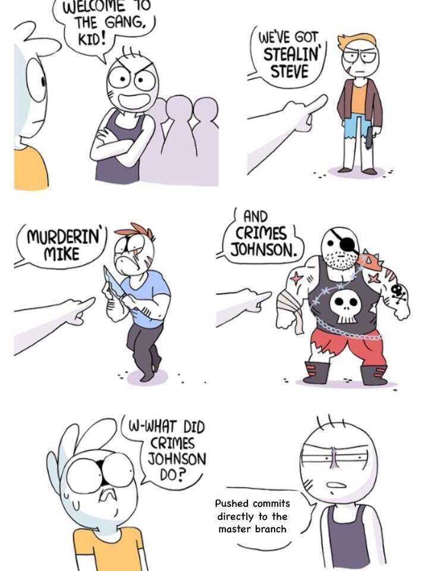

# Intro {.sidebar}

This dashboard covers the course materials for the course [***Markup Languages and Reproducible Programming in Statistics***](http://www.geneeskunde-utrecht.nl/blackboard/oc_redirect.php?courseid=SW-2019-REMA1-201700029-V)

---

Instructor: [Gerko Vink](http://www.gerkovink.com)  
Study load: 2.5 ECTS  
Assessment: Final Assignment  
[Course SurfDrive folder](https://surfdrive.surf.nl/files/index.php/s/2rJYcImUkYEvIC9)

---

| When?  |       | Where?      |
|--------|-------|-------------|
| 29-Oct | 10 am | Ruppert 031 |
| 05-Nov | 10 am | Ruppert 031 |
| 12-Nov | 10 am | Ruppert 031 |
| 19-Nov | 10 am | Ruppert 031 |
| 26-Nov | 10 am | Ruppert 031 |
| 03-Dec | 10 am | Ruppert 031 |
| 10-Dec | 10 am | Ruppert 031 |
| 17-Dec | 10 am | Ruppert 031 |

---
# Quick Overview

## Column 1

### Markup Languages and Reproducible Programming in Statistics 2019 
This course gives an overview of the state-of-the-art in statistical markup, reproducible programming and scientific digital representation. Students will get to know the professional field of statistical markup and its innovations and challenges. It consists of 8 meetings in which students will learn about markup languages ([$\LaTeX$](https://www.latex-project.org) and [Markdown](https://daringfireball.net/projects/markdown/)), learn efficient programming with [rMarkdown](https://rmarkdown.rstudio.com), experience developing [Shiny](https://shiny.rstudio.com) web apps, get to know version control with [Git](https://git-scm.com) and will create and maintain their own data archive repository and personal (business card style) page through [GitHub](https://github.com) . Combining these lectures, the students get acquainted with different viewpoints on marking up statistical manuscripts, areas of innovation, and challenges that people face when working with, analysing and reporting (simulated) data. 

Knowledge obtained from this course will help students face multidimensional problems during their professional career.

### Assignment and Grading

The final grade is computed as follows

| Graded part       | Weight      |
|:-------|:------|
| Markup manuscript | 30 % |
| Research repository | 30 % |
| Personal repository | 10 % |
| Shiny app | 15 % |
| Visual presentation | 15 % |

To develop the necessary skills for completing the assignment and the presentation, 7 exercises must be made and submitted. These exercises are not graded, but students must fulfil them to pass the course.

In order to pass the course, the final grade must be 5.5 or higher, your contribution to the course should be sufficient and all assignments and practical assignments should be handed in and/or passed. Otherwise, additional work is required concerning the assignments and/or exercises you have failed.

## Column 2

### Schedule
| When?  |       | Where?      | What?                                   |
|:-------|:------|:------------|:----------------------------------------|
| 28-Oct | 10 am | Ruppert 031 | LaTeX and Bibliographies                |
| 04-Nov | 10 am | Ruppert 031 | Beamer presentations and equations      |
| 11-Nov | 10 am | Ruppert 031 | Tables and Figures                      |
| 18-Nov | 10 am | Ruppert 031 | A reproducible workflow with rMarkdown  |
| 25-Nov | 10 am | Ruppert 031 | Version control and GitHub repositories |
| 02-Dec | 10 am | Ruppert 031 | Presentations with markdown             |
| 09-Dec | 10 am | Ruppert 031 | Github pages and Shiny apps             |
| 16-Dec | 10 am | Ruppert 031 | Presentations                           |

### For fun

Expand $(a+b)^n$:
$$
\begin{gather*}
  (a + b)^n\\
  (a\ + \ b)^n\\
  (a\quad + \quad b)^n\\
  (a\qquad + \qquad b)^n
\end{gather*}
$$
[source](https://tex.stackexchange.com/questions/18326/latex-math-jokes)

# Course Manual

## Column 1

### Course manual

[I'd rather have a pdf](docs/MLRPS2019_manual.pdf)

#### Course description
This course gives an overview of the state-of-the-art in statistical markup, reproducible programming and scientific digital representation. Students will get to know the professional field of statistical markup and its innovations and challenges. It consists of 8 meetings in which students will learn about markup languages (LaTeX and Markdown), learn efficient programming with rMarkdown, experience developing Shiny web apps, get to know version control with Git and will create and maintain their own data archive repository and personal (business card) page through GitHub. Combining these lectures, the students get acquainted with different viewpoints on marking up statistical manuscripts, areas of innovation, and challenges that people face when working with, analysing and reporting (simulated) data. Knowledge obtained from this course will help students face multidimensional problems during their professional career.

#### Assignment
Students will individually choose one statistical topic and work on a manuscript about this topic. Students will need to perform calculations and program code for this manuscript. All work for the student needs to be combined in an easy understandable and insightful data archive and will need be posted on a personal GitHub repository. This end result will be graded on 

1. Quality of the markup language skills, 
2. Quality of the data archive, and, 
3. Quality of the online repository.

#### Grading
Students will be evaluated on the following aspects:

1. Developing and publishing a research archive that contains code, data and a typeset manuscript following a markup language;
2. Developing and publishing a personal repository page;
3. Creating a visual presentation about the progress made in this course.

Further, 

  a. Students develop fundamental knowledge and understanding in the state of the art in statistical markup   languages and reproducible programming (Knowledge and Understanding) 
  b. They apply their knowledge in a multi-disciplinary context to contemporary problems (Applying)
  c. They can determine the most effective markup strategies to address a typesetting problem (Applying)
  d. They can efficiently organise a reproducible programming process (Applying)
  e. They can advise researchers in applying the current state of the art in markup and programming (Judgment)
  f. They can produce repositories up to the standards of international programming and coding conventions and initiatives (Communication)
  g. They can produce publications up to the typesetting standards of international peer- reviewed journals (Communication)
  h. They are capable of autonomous scholarly self-development (Learning skills)
  i. They give proof of being a responsible and scholarly professional (Learning skills)

After taking this course students can understand innovations in statistical markup, statistical simulation and reproducible research. Students are also able to approach challenges from different professional viewpoints. They have gained experience in marking up a professional manuscript and designing a state-of-the-art statistical archive in an open source repository.

To develop the necessary skills for completing the assignment and the presentation, 7 exercises must be made and submitted. These exercises are not graded, but students must fulfil them to pass the course.

The final grade is computed as follows

| Graded part       | Weight      |
|:-------|:------|
| Markup manuscript | 30 % |
| Research repository | 30 % |
| Personal repository | 10 % |
| Shiny app | 15 % |
| Visual presentation | 15 % |

In order to pass the course, the final grade must be 5.5 or higher, your contribution to the course should be sufficient and all assignments and practical assignments should be handed in and/or passed. Otherwise, additional work is required concerning the assignments and/or exercises you have failed.

#### Instructions for preparing the repositories
The research repository has to be prepared as a supplementary archive that can serve as an extensive documentation of the research (e.g. as a supplement to be submitted to a journal). The archive has to be published in a public or private GitHub repository.

#### Time schedule
This course takes place in the second half of the first semester. For students that follow the Master Programme MSBBSS; the course starts the week after the submission deadline for the thesis proposal.
The course will run for 8 weeks on Mondays, from 10am – 12.45am, starting October 28, 2019.

#### Prerequisites
Students will need their own laptop computer. Students should have experience in programming with R and should be familiar with the IDE RStudio.

# Week 1

## Column 1

### LaTeX and BibTex 

We start with a simple introduction to the `LaTeX` environment. Just as with any new *language* aimed at programming and/or scripting: practice makes perfect. Follow the two exercises for this week and you'll have a head start on the wealth of marking up your documents with $\LaTeX$. 

All the best, 

[Gerko](www.gerkovink.com)

### Supplementary materials and links

The following links may be very useful: 

- [LaTeX Wikibook](https://en.wikibooks.org/wiki/LaTeX)

If your references contain long urls:

- [a fix](https://tex.stackexchange.com/questions/287748/references-not-respecting-margins-with-biblatex)

### For fun

[source](https://xkcd.com/184/) and [LaTeX code](images/funny.tex)

## Column 2

### Slides

- [Slides Week 1](Wk1/Wk1_-_LaTeX_and_BibTeX.html) 

You can print the presentation to pdf if you prefer a paginated format.
 
### Exercises

- [Exercise 1](Wk1/Exercise 1/Exercise_1.html)

  - [LaTeX background](Wk1/Exercise 1/LaTeX background/) [[zipped version]](Wk1/Exercise 1/LaTeX background.zip)
  - [LaTeX_template.tex](Wk1/Exercise 1/LaTeX_template.tex)
  - [LaTeX_template.pdf](Wk1/Exercise 1/LaTeX_template.pdf)
  - [Virgil - Aeneid.rtf](Wk1/Exercise 1/Virgil - Aeneid.rtf)

***

- [Exercise 2](Wk1/Exercise 2/Latex exercise/Exercise_2.html)
  
  - [LaTeX_template.tex](Wk1/Exercise 2/LaTeX_template.tex)
  - [LaTeX_template.pdf](Wk1/Exercise 2/LaTeX_template.pdf)
  - [bib_template.tex](Wk1/Exercise 2/Latex exercise/bib_template.tex)
  - [bib_template.pdf](Wk1/Exercise 2/Latex exercise/bib_template.pdf)
  - [exercises.bib](Wk1/Exercise 2/Latex exercise/exercises.bib)
  - [Latex background.zip](Wk1/Exercise 2/Latex exercise/Latex background.zip)

***

- [**Solutions to the excercises!**](Wk1/Solutions.zip)

# Week 2

## Column 1

### Beamer and equations

This week we'll cover equations in `LaTeX` - I'm sure you'll love it. We will also use `LaTeX` to design slide show presentations. Later on in this course, we'll focus on creating presentation with Markdown - which is much easier, but also less flexible in obtaining perfect detailed typesetting. For now, getting to know the basics of presentations and equations in `LaTeX` will pay off in the future. 

All the best, 

[Gerko](www.gerkovink.com)

### Supplementary materials and links

The following links are very useful: 

- [`beamer` quickstart](https://userpages.umbc.edu/~rostamia/beamer/)
- [`beamer` themes](https://hartwork.org/beamer-theme-matrix/)
- [Short and fancy intro to `beamer`](https://math-linux.com/latex-26/article/how-to-make-a-presentation-with-latex-introduction-to-beamer)
- [Math symbols cheat sheet](Wk2/Exercise 3/LaTeX background/Math in LaTeX/Math Symbols.pdf)
- [Short math guide](Wk2/Exercise 3/LaTeX background/Math in LaTeX/short-math-guide.pdf)

### For fun

<blockquote class="twitter-tweet" data-lang="en">
My wife asked me what machine learning is and I said: remember when we ordered the hot plate for the boat and amazon suggested buying all the equipment needed to make a full meth lab?
&mdash; (((Kane Baccigalupi))) (@rubyghetto) <a href="https://twitter.com/rubyghetto/status/1058220004301127680?ref_src=twsrc%5Etfw">November 2, 2018</a></blockquote>

## Column 2

### Exercise

This week's excercise:

- [Exercise 3](Wk2/Exercise 3/Exercise_3.html)
- [beamer_exercise.pdf](Wk2/Exercise 3/beamer_exercise.pdf)
- [Latex background](Wk2/Exercise 3/LaTeX background.zip)

***

- [Solution to the exercise](Wk2/Solution.zip)

 

# Week 3

## Column 1

### Beamer and equations

This week we'll cover tables and figures in `LaTeX` 

All the best, 

[Gerko](www.gerkovink.com)

### Supplementary materials and links

The following links are very useful: 

- [The Not So Short Introduction to `LaTeX`](http://tug.ctan.org/info/lshort/english/lshort.pdf) by Tobias Oetiker, Hubert Partl, Irene Hyna and Elisabeth Schlegl

### For fun
**Spoiler alert for [Silicon Valley](https://www.hbo.com/silicon-valley/cast-and-crew)**

<iframe width="500" height="315" src="https://www.youtube.com/embed/SsoOG6ZeyUI" frameborder="0" allow="accelerometer; autoplay; encrypted-media; gyroscope; picture-in-picture" allowfullscreen></iframe>

## Column 2

### Exercise

This week's excercise:

- [Exercise 4](Wk3/Exercise_4.html)
- [Latex background.zip](Wk3/LaTeX background.zip)

***

- [Solution to the exercise](Wk3/Answer/2. Solution in Tex.tex)

# Week 4
## Column 1

### Reproducible workflows

This week we'll cover reproducible workflows with [`rmarkdown`](https://rmarkdown.rstudio.com) in [`RStudio`](https://www.rstudio.com)

All the best, 

[Gerko](www.gerkovink.com)

### For real

<iframe src="https://player.vimeo.com/video/178485416?color=428bca&title=0&byline=0&portrait=0" width="500" height="315" frameborder="0" webkitallowfullscreen mozallowfullscreen allowfullscreen></iframe>

<a href="https://vimeo.com/178485416">What is R Markdown?</a> from <a href="https://vimeo.com/rstudioinc">RStudio, Inc.</a> on <a href="https://vimeo.com">Vimeo</a>.

### Supplementary materials and links

The following links are very useful: 

- [RStudio's 'Getting Started' with `rmarkdown`](https://rmarkdown.rstudio.com/lesson-2.html)
- [An example archive](https://github.com/gerkovink/Pooling_MI)

## Column 2

### Exercise and lecture

This week's documents:

- [Lecture Wk4](Wk4/Wk4_slides.html)
- [Exercise 5.html](Wk4/Exercise_5.html)
- [Exercise 5.Rmd](https://raw.githubusercontent.com/gerkovink/Markup-Programming/master/Wk4/Exercise%205.Rmd?token=AGegKG2RgrhPwm_Lxyscb7rrikKvDvpcks5cBQW0wA%3D%3D)
- [Background.zip](Wk4/Background.zip)
- [Solution to the exercise in `Rmd`](Wk4/Solution_to_Ex5.Rmd)
- [Solution to the exercise in `html`](Wk4/Solution_to_Ex5.html)

### For fun

 

[source](https://geekandpoke.typepad.com/geekandpoke/2009/07/the-art-of-programming-part-2.html)

# Week 5

## Column 1

### Git and GitHub

This week we’ll cover version control with [git](https://git-scm.com) in [`RStudio`](https://www.rstudio.com)

All the best, 

[Gerko](www.gerkovink.com)

### Supplementary materials and links

The following links are very useful:

- [GitHub Glossary](https://help.github.com/articles/github-glossary) for all terminology
- [This online book](https://git-scm.com/book/en/v2) is most comprehensive as a resource
- [Use this webpage](http://try.github.io) to try and experience `git` via a chain of tutorials

### For fun

 

[source](https://dzone.com/articles/git-forked)

## Column 2

### Exercise and lecture

This week's documents:

- [Exercise 6.html](Wk5/Exercise_6_-_Git_and_GitHub.html)
- [Exercise 6.Rmd](Wk5/Exercise 6 - Git and GitHub.Rmd)
<!-- - [Solution to exercise 6](Wk5/Solution Ex6.mp4) -->

### For fun 2

 

[source](https://imgs.xkcd.com/comics/git.png)

# Week 6

## Column 1

### Presentations with `rmarkdown`

This week we’ll cover presentations with `rmarkdown` in [`RStudio`](https://www.rstudio.com)

All the best, 

[Gerko](www.gerkovink.com)

### Supplementary materials and links

The following link is very useful:

- [The definitive `rmarkdown` Guide](https://bookdown.org/yihui/rmarkdown/)

### For fun

 

[source](https://www.reddit.com/r/ProgrammerHumor/comments/9w19dv/we_all_know_someone_whos_done_that/) and  [original](https://i.kym-cdn.com/photos/images/newsfeed/001/319/580/b9a.jpg_large)

## Column 2

### Exercise

This week's documents:

- [Exercise 7.html](Wk6/Exercise_7_-_presentations_with_rmarkdown.html)
- [Exercise 7.Rmd](https://raw.githubusercontent.com/gerkovink/Markup-Programming/master/Wk6/Exercise%207%20-%20presentations%20with%20rmarkdown.Rmd?token=AGegKBdG_PcSgsOf01TE-qE32Ue-PC9xks5cDgZTwA%3D%3D)
- [Background.zip](Wk6/Background.zip)

# Week 7

## Column 1

### Online representation

This week we’ll cover `shiny` web-apps and `GitHub` pages. `shiny` is a wonderfull means to showcase your work and offer online services. `GitHub` pages is the way for developers and professionals to introduce yourself to the world and host a personal webpage right from your `GitHub`. And all this is free!

All the best, 

[Gerko](www.gerkovink.com)

### For fun

 

[source](https://www.reddit.com/r/ProgrammerHumor/comments/a1j42g/merriamwebster_finally_added_a_definition_for/) 

## Column 2

### Exercise

This week's documents:

- [Exercise 8.html](Wk7/Exercise_8_-_GitHub_pages_and_Shiny.html)
- [Exercise 8.Rmd](https://raw.githubusercontent.com/gerkovink/Markup-Programming/master/Wk7/Exercise%208%20-%20presentations%20with%20rmarkdown.Rmd?token=AGegKBdG_PcSgsOf01TE-qE32Ue-PC9xks5cDgZTwA%3D%3D)

### Useful references

Definitely look at the book [Mastering Shiny](https://mastering-shiny.org) by [Hadley Wickham](http://hadley.nz). This book is currently under development. 

<!-- ### For wowz -->
<!-- 
  -->
<!-- 
 -->
<!--  -->
<!-- 
 -->
<!-- 
 -->

<!-- [source](https://g.redditmedia.com/wuVd9DqvSIpCpvwksHQPeyyn43dGmPxHuXhLG9uXN04.gif?fit=crop&crop=faces%2Centropy&arh=2&w=960&fm=mp4&mp4-fragmented=false&s=63d670ca5ca29e52bef6e3f97e7184d3) -->

